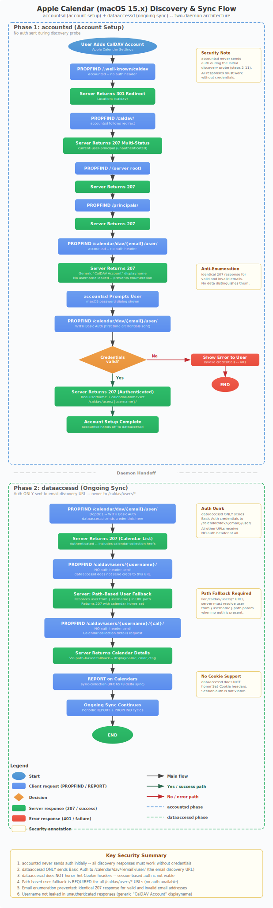

# Apple Calendar Integration



This guide covers setting up Apple Calendar (macOS and iOS) with the CalDAV server, including the technical details of how Apple's discovery and sync mechanisms work.

## Setup Instructions

### Prerequisites

1. A user account with an email address:
   ```bash
   caldav-server create-user --username alice --password 'secret' --email alice@example.com
   ```
   The email is required for Apple Calendar's email-based discovery.

2. The server must be reachable from your Mac/iPhone (same network, VPN, or public internet with TLS).

### macOS (Calendar.app)

1. Open **System Settings** > **Internet Accounts** > **Add Account** > **Other** > **CalDAV Account**
2. Select **Advanced** account type
3. Fill in:
   - **Account Type:** Manual
   - **Username:** `alice` (your username)
   - **Password:** `secret` (your password)
   - **Server Address:** `your-server-hostname:5232`
4. Click **Sign In**

Apple Calendar will perform the discovery sequence (described below) and set up the account.

### iOS (Calendar)

1. Open **Settings** > **Calendar** > **Accounts** > **Add Account** > **Other** > **Add CalDAV Account**
2. Fill in:
   - **Server:** `your-server-hostname:5232`
   - **Username:** `alice`
   - **Password:** `secret`
3. Tap **Next**

## How Apple Calendar Works

Apple Calendar on macOS uses two system daemons for CalDAV:

| Daemon | Role | Sends Auth? |
|--------|------|-------------|
| `accountsd` | Account setup and discovery | Only to email discovery URL after user enters password |
| `dataaccessd` | Ongoing calendar sync | Only to email discovery URL (never to `/caldav/users/*`) |

### Phase 1: Account Discovery (accountsd)

When you add a CalDAV account, `accountsd` probes the server to verify it's a valid CalDAV service. **It does not send credentials initially.**

```
accountsd                                     Server
    │                                            │
    ├─── PROPFIND /.well-known/caldav ──────────>│
    │<── 301 → /caldav/ ────────────────────────│
    │                                            │
    ├─── PROPFIND /caldav/ ─────────────────────>│
    │<── 207 (unauthenticated principal) ───────│
    │                                            │
    ├─── PROPFIND / ────────────────────────────>│
    │<── 207 ───────────────────────────────────│
    │                                            │
    ├─── PROPFIND /principals/ ─────────────────>│
    │<── 207 ───────────────────────────────────│
    │                                            │
    ├─── PROPFIND /calendar/dav/alice@ex.com/user/ ─>│
    │<── 207 (generic "CalDAV Account") ────────│
    │                                            │
    │  [User enters password in UI]              │
    │                                            │
    ├─── PROPFIND /calendar/dav/alice@ex.com/user/ ─>│
    │    (WITH Authorization: Basic ...)         │
    │<── 207 (username + calendar-home-set) ────│
    │                                            │
    │  [Account setup complete]                  │
```

**Security implications:**
- The initial probes receive no user data (generic responses prevent email enumeration)
- The email discovery URL (`/calendar/dav/{email}/user/`) returns identical 207 responses for valid and invalid emails when unauthenticated
- The username is only revealed after successful authentication

### Phase 2: Calendar Sync (dataaccessd)

Once the account is set up, `dataaccessd` handles ongoing synchronization. **It only sends credentials to the email discovery URL** and never to `/caldav/users/*` paths.

```
dataaccessd                                   Server
    │                                            │
    ├─── PROPFIND /calendar/dav/alice@ex.com/user/ ─>│
    │    (Depth:1, WITH auth)                    │
    │<── 207 (calendar list) ───────────────────│
    │                                            │
    ├─── PROPFIND /caldav/users/alice/ ─────────>│
    │    (NO auth header!)                       │
    │<── 207 (calendar home via path fallback) ──│
    │                                            │
    ├─── PROPFIND /caldav/users/alice/cal-id/ ──>│
    │    (NO auth header!)                       │
    │<── 207 (calendar details via path fallback)│
    │                                            │
    ├─── REPORT /caldav/users/alice/cal-id/ ────>│
    │    (sync-collection, NO auth)              │
    │<── 207 (events + sync-token) ─────────────│
    │                                            │
    │  [Ongoing sync continues...]               │
```

**Why no auth on `/caldav/users/*`?** This is a known Apple Calendar behavior (macOS 15.x). `dataaccessd` stores credentials but only sends them to the URL where `accountsd` originally authenticated. It does NOT send credentials to discovered calendar home URLs.

**Why no cookies?** `dataaccessd` does not honor `Set-Cookie` headers from the server. Session-based auth is not viable.

## Server Compatibility Features

The following features were implemented specifically for Apple Calendar compatibility:

### 1. Email Discovery Endpoint

`/calendar/dav/{email}/user/` is Apple's proprietary CalDAV discovery endpoint. It maps email addresses to CalDAV principals.

**Unauthenticated:** Returns 207 with generic data (no enumeration, no username leak).

**Authenticated (Depth:0):** Returns principal info with real username.

**Authenticated (Depth:1):** Returns principal info + full calendar list.

### 2. Path-Based User Fallback (auth_or_path_user)

Since `dataaccessd` doesn't send auth to `/caldav/users/*`, the server extracts the username from the URL path and looks up the user in the database. No password check is performed for this fallback.

**Calendar ownership is verified after authentication** - the fallback only resolves the user identity; it does not grant access to other users' calendars.

### 3. Inline Auth (Not Middleware)

Auth is handled inside each handler, not as axum middleware. This allows discovery endpoints to return 207 without credentials while still supporting auth when provided.

If middleware returned 401 for missing credentials, `accountsd`'s initial probe would fail immediately.

### 4. Consistent Unauthenticated Responses

All discovery endpoints return valid 207 responses without credentials:
- `/.well-known/caldav` -> 301 redirect
- `/caldav/` -> 207 with `<D:unauthenticated/>` principal
- `/` -> 207
- `/principals/` -> 207
- `/calendar/dav/{email}/user/` -> 207 with generic displayname

## Troubleshooting

### "Unable to verify account" error

**Causes:**
1. Server not reachable (check network/firewall)
2. Email not set on user account (run `create-user` with `--email`)
3. Wrong server address in Apple Calendar settings

**Debug:** Enable `RUST_LOG=debug` and watch for `accountsd` probe requests.

### Calendars not syncing

**Causes:**
1. `dataaccessd` can't reach `/caldav/users/*` paths (check reverse proxy config)
2. Calendar ownership issue (verify the calendar belongs to the user)

**Debug:** Look for PROPFIND requests to `/caldav/users/{username}/` in server logs.

### Events appear in wrong calendar

**Cause:** Calendar ID mismatch. Apple Calendar may cache stale discovery data.

**Fix:** Remove and re-add the CalDAV account in System Settings.

### Password change not taking effect

**Cause:** `dataaccessd` caches credentials.

**Fix:** Remove and re-add the account, or restart `dataaccessd`:
```bash
sudo killall dataaccessd
```

## Known Limitations

1. **Path-based fallback security:** Anyone who knows a valid username can access their calendars without credentials via `/caldav/users/{username}/*`. Mitigate with VPN/firewall restrictions and non-guessable usernames.

2. **No push notifications:** Apple Calendar supports CalDAV push (Apple Push Notification Service), but this server doesn't implement it. Sync relies on polling intervals set by `dataaccessd`.

3. **No VTODO support in Apple Calendar:** While the server stores VTODOs, Apple Calendar (macOS) doesn't display them. Use Apple Reminders for tasks.

4. **Cookie-based sessions not viable:** `dataaccessd` ignores `Set-Cookie` headers. Per-request auth (HTTP Basic) is the only reliable mechanism.
