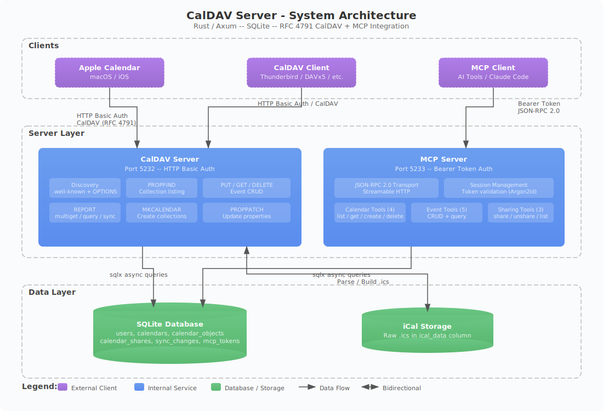

# Architecture Overview



## System Components

The CalDAV server is a single Rust binary that runs two independent HTTP servers on separate ports, sharing a single SQLite database.

### CalDAV Server (Port 5232)

The primary CalDAV server implements RFC 4791 on top of the [axum](https://github.com/tokio-rs/axum) web framework. It handles all standard CalDAV operations: discovery, property queries, calendar management, event CRUD, and reporting.

**Key characteristics:**
- HTTP Basic Auth for client authentication
- Inline auth (not middleware) to support Apple Calendar's credential quirks
- WebDAV-style XML request/response bodies
- Supports custom HTTP methods: PROPFIND, PROPPATCH, MKCALENDAR, REPORT
- Uses `any()` routing since axum's `MethodFilter` only supports 9 standard HTTP methods

### MCP Server (Port 5233)

A separate HTTP server implementing the [Model Context Protocol](https://modelcontextprotocol.io/) (version 2025-03-26) for programmatic calendar access by AI tools and automation.

**Key characteristics:**
- Bearer token authentication via middleware
- JSON-RPC 2.0 transport over Streamable HTTP
- 12 tools covering calendars, events, and sharing
- Session management for long-lived connections

### SQLite Database

A single SQLite database file with WAL (Write-Ahead Logging) journal mode for concurrent read access. The schema contains 6 tables managing users, calendars, events, sharing, sync state, and API tokens.

**Key characteristics:**
- Single-file deployment (portable, easy backup)
- Async queries via [sqlx](https://github.com/launchbadge/sqlx)
- Foreign key enforcement enabled
- Schema portable to PostgreSQL if needed

## Project Structure

```
src/
├── main.rs                  # CLI entry point + server startup
├── config.rs                # Environment variable configuration
├── error.rs                 # AppError / AppResult types
├── caldav/
│   ├── mod.rs               # Router setup + auth helpers (inline_auth, auth_or_path_user)
│   ├── auth.rs              # HTTP Basic Auth parsing + 401 builder
│   ├── wellknown.rs         # /.well-known/caldav handler
│   ├── propfind.rs          # PROPFIND at all URL levels
│   ├── get.rs               # GET calendar objects (.ics)
│   ├── put.rs               # PUT events (create/update with ETag)
│   ├── delete.rs            # DELETE objects and calendars
│   ├── report.rs            # REPORT: multiget, query, sync-collection
│   ├── mkcalendar.rs        # MKCALENDAR handler
│   ├── proppatch.rs         # PROPPATCH handler
│   └── xml/
│       ├── mod.rs           # XML namespace constants
│       ├── properties.rs    # Property XML builders
│       ├── multistatus.rs   # 207 Multi-Status response builder
│       └── parse.rs         # Parse PROPFIND/REPORT XML bodies
├── mcp/
│   ├── mod.rs               # MCP router (/mcp POST/GET/DELETE)
│   ├── auth.rs              # Bearer token middleware
│   ├── handlers.rs          # JSON-RPC 2.0 dispatcher
│   ├── jsonrpc.rs           # Request/response structs
│   ├── session.rs           # Session manager
│   ├── transport.rs         # HTTP streaming transport
│   └── tools/
│       ├── mod.rs           # Tool registry + dispatch
│       ├── calendars.rs     # 4 calendar tools
│       ├── events.rs        # 5 event tools
│       └── sharing.rs       # 3 sharing tools
├── db/
│   ├── mod.rs               # Pool init + migration runner
│   ├── models.rs            # Data models (User, Calendar, CalendarObject, etc.)
│   ├── users.rs             # User CRUD + password hashing
│   ├── calendars.rs         # Calendar CRUD + ctag management
│   ├── events.rs            # Event upsert + queries + sync logging
│   ├── shares.rs            # Calendar sharing CRUD
│   └── tokens.rs            # MCP token generation + validation
└── ical/
    ├── mod.rs               # Module declaration
    ├── parser.rs            # Extract UID, DTSTART, DTEND, SUMMARY from .ics
    └── builder.rs           # Build VCALENDAR/VEVENT from fields
```

## Design Decisions

### Why No `dav-server` Crate?

The existing Rust `dav-server` crate implements RFC 4918 (WebDAV) but not RFC 4791 (CalDAV). CalDAV requires calendar-specific extensions: `MKCALENDAR`, `calendar-query` REPORT, `calendar-multiget` REPORT, `sync-collection`, and CalDAV-specific XML properties. Building directly on axum provides full control over the protocol implementation.

### Why Inline Auth Instead of Middleware?

Apple Calendar's `dataaccessd` daemon has a critical quirk: it only sends HTTP Basic Auth credentials to the URL where `accountsd` originally authenticated. It does **not** send credentials to other URLs (like `/caldav/users/*`), even after receiving a 401 challenge. Middleware-based 401 responses would break the sync flow entirely.

Instead, each handler calls one of two auth functions:
- **`inline_auth`**: Strict - requires Authorization header, returns 401 if missing
- **`auth_or_path_user`**: Flexible - tries HTTP Basic first, falls back to path-based username lookup

### Why SQLite Over PostgreSQL?

Single-file deployment simplifies operations for personal/small-team use. The schema is designed to be portable to PostgreSQL via sqlx if scaling is needed. SQLite with WAL mode provides sufficient concurrent read performance.

### Why Separate Ports?

CalDAV (port 5232) and MCP (port 5233) use different authentication mechanisms (HTTP Basic vs Bearer Token) and serve different client types. Separate ports allow independent firewall rules - for example, restricting CalDAV to a VPN while exposing MCP to a local AI tool.

### Why Raw iCal Storage?

Calendar objects are stored as raw `.ics` text in the `ical_data` column, with extracted fields (UID, DTSTART, DTEND, SUMMARY) in indexed columns for queries. This is the standard approach used by Radicale, Stalwart, and other CalDAV servers. It preserves all iCal properties that clients may set without needing to model every possible field.

### Why Pre-Shared Bearer Tokens for MCP?

Simpler than OAuth 2.1 for a self-hosted server. Tokens are generated via CLI, hashed with Argon2id (same algorithm as passwords), and stored in the database. This avoids the complexity of authorization flows while maintaining security through strong hashing and optional expiration.

## Data Flow

### CalDAV Request Path

```
Client Request
    ↓
axum Router (any() catch-all)
    ↓
Method Dispatch (OPTIONS/PROPFIND/PUT/GET/DELETE/REPORT/MKCALENDAR/PROPPATCH)
    ↓
Auth (inline_auth or auth_or_path_user)
    ↓
Calendar Ownership Verification
    ↓
Business Logic (DB queries, iCal parse/build)
    ↓
XML Response (207 Multi-Status for most operations)
    ↓
HTTP Response
```

### MCP Request Path

```
Client Request (POST /mcp)
    ↓
Bearer Token Middleware (require_bearer_auth)
    ↓
JSON-RPC 2.0 Parser
    ↓
Method Router (initialize/tools/list/tools/call/ping)
    ↓
Tool Dispatch (12 tools)
    ↓
DB Operations
    ↓
JSON-RPC Response
```

## Dependencies

| Crate | Version | Purpose |
|-------|---------|---------|
| axum | 0.8 | HTTP framework |
| axum-extra | 0.10 | Typed headers |
| tower-http | 0.6 | Tracing/CORS middleware |
| tokio | latest | Async runtime |
| quick-xml | 0.37 | XML parsing and generation |
| sqlx | 0.8 | Async SQLite driver |
| argon2 | 0.5 | Password/token hashing (Argon2id) |
| uuid | 1 | ID generation (v4 for ETags, v7 for PKs) |
| serde / serde_json | latest | JSON serialization |
| chrono | latest | Date/time handling |
| tracing | latest | Structured logging |
| clap | 4 | CLI argument parsing |
| base64 | latest | Token encoding |
| rand | latest | Cryptographic random for tokens |

## Test Coverage

The project includes 72+ unit tests covering:
- Database CRUD operations for all tables
- iCal parsing and building
- Security tests (12 tests for enumeration, cross-user access, credential validation)
- ETag and conditional request handling
- Password and token hashing/verification
- Auth flow edge cases
