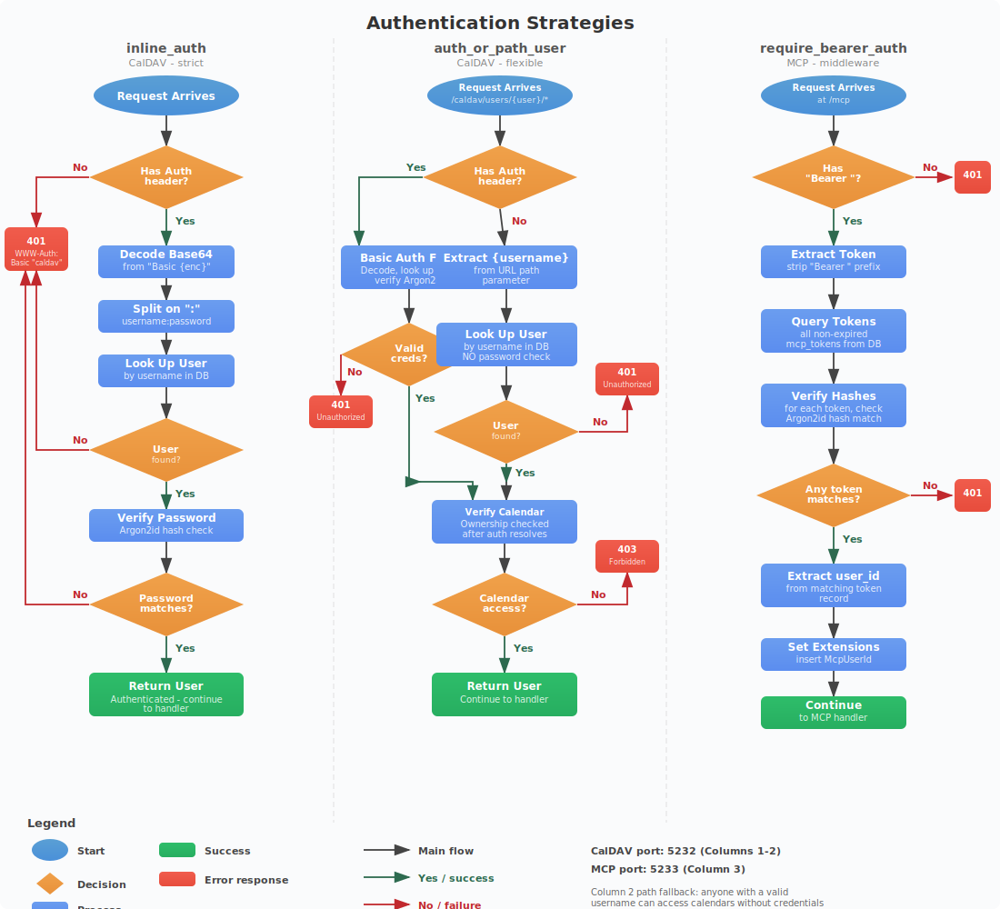

# Authentication & Security



The CalDAV server uses a layered authentication model with three distinct strategies, each designed for specific endpoint requirements. The design is driven by Apple Calendar's credential handling quirks on macOS 15.x.

## Authentication Strategies

### 1. inline_auth (Strict CalDAV Auth)

Used by endpoints that always require credentials.

**How it works:**
1. Check for `Authorization` header in the request
2. If missing: return `401 Unauthorized` with `WWW-Authenticate: Basic realm="caldav"` header
3. Decode Base64 from `Basic {encoded}` value
4. Split decoded string on `:` to get `username:password`
5. Look up user by username in the database
6. Verify password against stored Argon2id hash (timing-safe comparison)
7. If invalid: return `401 Unauthorized`
8. If valid: return the authenticated `User` object

**Used by:**
- Email discovery endpoint (`/calendar/dav/{email}/user/`) when credentials are present

### 2. auth_or_path_user (Flexible CalDAV Auth)

Used by calendar home and collection endpoints. Tries HTTP Basic Auth first, then falls back to path-based user lookup.

**How it works:**
1. Check for `Authorization` header
2. If present: follow the same flow as `inline_auth` (decode, verify, return user)
3. If absent: extract `{username}` from the URL path parameter
4. Look up user by username in the database
5. If user not found: return `401 Unauthorized`
6. If found: return the `User` object **without password verification**
7. **Calendar ownership is verified after authentication** to prevent cross-user access

**Why this exists:** Apple Calendar's `dataaccessd` daemon only sends HTTP Basic Auth credentials to the URL where `accountsd` originally authenticated (the email discovery endpoint). It does NOT send credentials to `/caldav/users/*` URLs, even after receiving a 401 challenge. Without this fallback, Apple Calendar sync would break entirely.

**Used by:**
- Calendar home (`/caldav/users/{username}/`)
- Calendar collection (`/caldav/users/{username}/{calendar_id}/`)
- Calendar objects (`/caldav/users/{username}/{calendar_id}/{uid}.ics`)

### 3. require_bearer_auth (MCP Middleware)

Used as axum middleware on all MCP endpoints.

**How it works:**
1. Check for `Authorization` header starting with `Bearer `
2. If missing: return `401 Unauthorized`
3. Extract the token string after `Bearer `
4. Query all MCP tokens from the database
5. For each token, verify the provided token against the stored Argon2id hash
6. If no match: return `401 Unauthorized`
7. If match found: extract `user_id` from the matching token record
8. Insert `user_id` into request extensions for downstream handlers

**Used by:**
- All `/mcp` endpoints (POST, GET, DELETE)

## Security Model

### CalDAV Port (5232)

The CalDAV port has a layered security approach balancing Apple Calendar compatibility with data protection:

#### Layer 1: Discovery URLs (Public)

| Endpoint | Auth | Data Returned |
|----------|------|---------------|
| `/.well-known/caldav` | None | 301 redirect only |
| `/` | None | `<D:unauthenticated/>` principal |
| `/caldav/` | None | `<D:unauthenticated/>` principal |
| `/principals/` | None | `<D:unauthenticated/>` principal |
| `/principals/{user}/` | None | `<D:unauthenticated/>` principal |

No user data is leaked. These return the minimum structure needed for CalDAV client discovery.

#### Layer 2: Email Discovery (Conditional)

| Endpoint | Auth | Data Returned |
|----------|------|---------------|
| `/calendar/dav/{email}/user/` | None | Generic "CalDAV Account" displayname |
| `/calendar/dav/{email}/user/` | Valid | Full response with username + calendars |
| `/calendar/dav/{email}/user/` | Invalid | 401 Unauthorized |

**Anti-enumeration:** The unauthenticated response is identical for valid and invalid email addresses. An attacker cannot determine whether an email exists on the server.

**Anti-leak:** The unauthenticated response uses a generic displayname ("CalDAV Account") instead of the actual username.

#### Layer 3: Calendar Paths (Auth + Ownership)

| Endpoint | Auth | Additional Check |
|----------|------|-----------------|
| `/caldav/users/{username}/` | auth_or_path_user | - |
| `/caldav/users/{username}/{cal}/` | auth_or_path_user | Calendar belongs to user (owner or shared) |
| `/caldav/users/{username}/{cal}/{uid}.ics` | auth_or_path_user | Calendar belongs to user (owner or shared) |

**Ownership verification:** Every request to a calendar or object endpoint checks that the resolved user owns the calendar or has a share entry. This prevents:
- Cross-user calendar access (Alice can't read Bob's calendars via URL manipulation)
- Shared calendar abuse (read-only shares can't modify)

#### Layer 4: Invalid Credential Handling

Invalid credentials always return `401 Unauthorized` with `WWW-Authenticate: Basic realm="caldav"`. They are never silently ignored, even when path-based fallback is available.

### MCP Port (5233)

The MCP port has simpler security - all endpoints require a valid Bearer token:

| Check | Behavior |
|-------|----------|
| No Authorization header | 401 |
| Invalid token format | 401 |
| Token not found in database | 401 |
| Expired token | 401 |
| Valid token | Proceed with user context |

## Password Hashing

Both user passwords and MCP tokens use Argon2id:

- **Algorithm:** Argon2id (hybrid of Argon2i and Argon2d)
- **Salt:** Per-password, generated with `OsRng` (cryptographically secure)
- **Verification:** Timing-safe comparison via `PasswordVerifier` trait
- **Standard:** OWASP-recommended for password storage

## Known Limitations

### Path-Based User Fallback

The `auth_or_path_user` fallback means anyone who knows a valid username can access that user's calendar data without credentials via `/caldav/users/{username}/*`. This is an inherent limitation of Apple Calendar's `dataaccessd` not sending credentials to these URLs.

**Mitigations:**
1. Use non-guessable usernames (UUIDs or random strings)
2. Restrict port 5232 via firewall/VPN to trusted networks
3. Calendar ownership verification prevents cross-user access even with the fallback
4. Invalid usernames return 401 (not 404), preventing username enumeration on these paths

### Token Validation Performance

MCP token validation iterates all tokens in the database and checks each hash. For servers with many tokens, this could become a performance concern. The current design prioritizes security (timing-safe comparison) over speed.

### No Rate Limiting

The server does not implement rate limiting on authentication attempts. Deploy behind a reverse proxy (nginx, Caddy) with rate limiting for production use.

### No TLS

The server listens on plain HTTP. Use a reverse proxy with TLS termination for production deployments:

```
Client --[HTTPS]--> Reverse Proxy --[HTTP]--> CalDAV Server (localhost:5232)
                                  --[HTTP]--> MCP Server (localhost:5233)
```

## Security Checklist for Deployment

- [ ] Use strong, non-guessable usernames
- [ ] Use strong passwords (Argon2id handles hashing)
- [ ] Deploy behind a TLS-terminating reverse proxy
- [ ] Restrict port 5232 to trusted networks (VPN/firewall)
- [ ] Restrict port 5233 to localhost or trusted AI tool hosts
- [ ] Enable rate limiting on the reverse proxy
- [ ] Regularly rotate MCP tokens
- [ ] Monitor access logs (enabled via tower-http TraceLayer)
