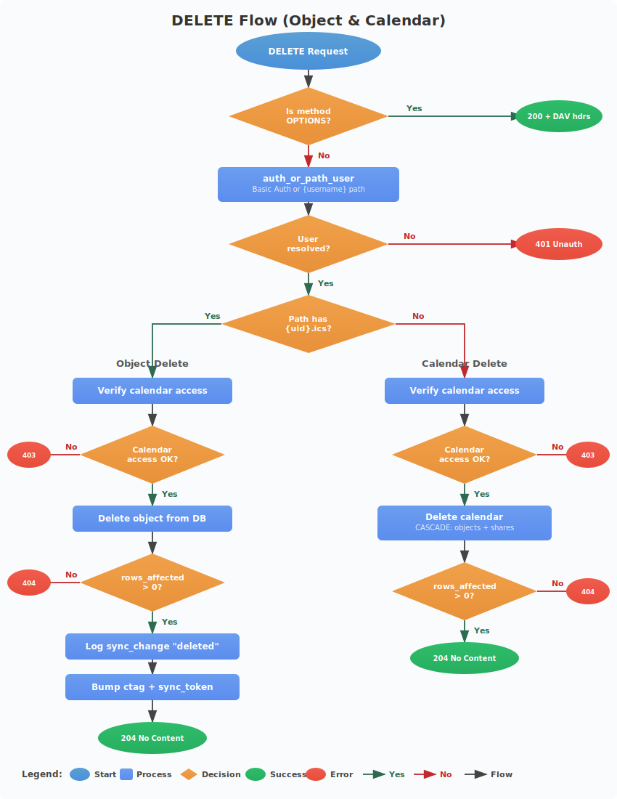
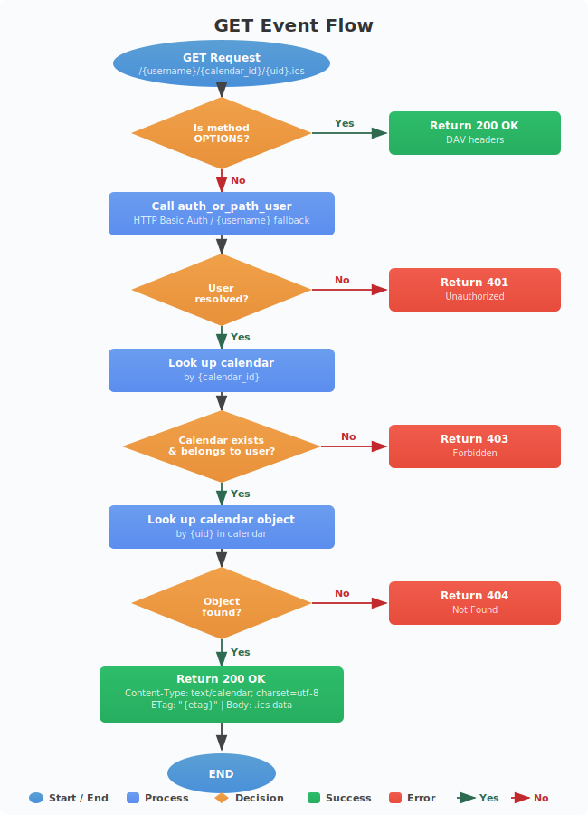
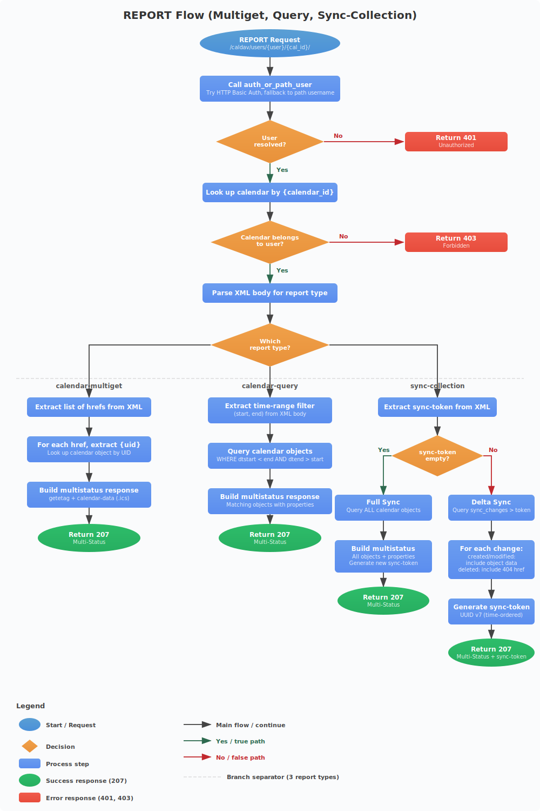

# CalDAV API Reference

The CalDAV server runs on port 5232 (configurable via `CALDAV_PORT`) and implements RFC 4791 (CalDAV), RFC 6578 (sync-collection), and RFC 6764 (well-known URI discovery).

## Authentication

All CalDAV endpoints use HTTP Basic Authentication. See [Authentication & Security](authentication.md) for full details on the three auth strategies.

```
Authorization: Basic base64(username:password)
```

Some endpoints work without authentication (discovery endpoints return minimal data), while others require it. Each endpoint's auth requirement is documented below.

## DAV Compliance Headers

Every endpoint responds to `OPTIONS` with:

```http
HTTP/1.1 200 OK
DAV: 1, 2, 3, calendar-access, calendar-schedule
Allow: OPTIONS, GET, HEAD, PUT, DELETE, PROPFIND, PROPPATCH, REPORT, MKCALENDAR
```

---

## Discovery Endpoints

### GET/PROPFIND `/.well-known/caldav`



The entry point for CalDAV service discovery (RFC 6764).

**Auth:** None required

**Behavior:** Returns `301 Moved Permanently` redirect to `/caldav/`.

```http
GET /.well-known/caldav HTTP/1.1
Host: example.com

HTTP/1.1 301 Moved Permanently
Location: /caldav/
```

### PROPFIND `/caldav/`

The CalDAV service root. Returns the current user principal.

**Auth:** Optional (different response with/without credentials)

**Request:**
```http
PROPFIND /caldav/ HTTP/1.1
Host: example.com
Depth: 0
Content-Type: application/xml

<?xml version="1.0" encoding="UTF-8"?>
<D:propfind xmlns:D="DAV:">
  <D:prop>
    <D:current-user-principal/>
    <D:resourcetype/>
  </D:prop>
</D:propfind>
```

**Response (unauthenticated):**
```http
HTTP/1.1 207 Multi-Status
Content-Type: application/xml; charset=utf-8

<?xml version="1.0" encoding="UTF-8"?>
<D:multistatus xmlns:D="DAV:">
  <D:response>
    <D:href>/caldav/</D:href>
    <D:propstat>
      <D:prop>
        <D:current-user-principal>
          <D:unauthenticated/>
        </D:current-user-principal>
        <D:resourcetype>
          <D:collection/>
        </D:resourcetype>
      </D:prop>
      <D:status>HTTP/1.1 200 OK</D:status>
    </D:propstat>
  </D:response>
</D:multistatus>
```

**Response (authenticated):**
Returns `<D:href>/caldav/principals/{username}/</D:href>` inside `current-user-principal`.

### PROPFIND `/` and `/principals/`

Fallback discovery endpoints. Return the same structure as `/caldav/` for compatibility with clients that probe these paths.

**Auth:** Optional

### PROPFIND `/calendar/dav/{email}/user/`

Apple Calendar's proprietary email-based discovery endpoint. Critical for macOS Calendar.app compatibility.

**Auth:** Optional (different responses based on auth state)

| Auth State | Depth | Response |
|-----------|-------|---------|
| None | 0 | 207 with generic "CalDAV Account" displayname. Same response for valid/invalid emails (prevents enumeration) |
| None | 1 | Same as Depth:0 (calendar list not returned without auth) |
| Valid credentials | 0 | 207 with real username and principal info |
| Valid credentials | 1 | 207 with principal info + full calendar list |
| Invalid credentials | any | 401 Unauthorized |

---

## Principal Endpoints

### PROPFIND `/caldav/principals/{username}/`

**Auth:** None required

**Behavior:** Returns `301 Moved Permanently` redirect to `/caldav/users/{username}/` (the calendar home).

---

## Calendar Home

### PROPFIND `/caldav/users/{username}/`


Lists all calendars owned by or shared with the user.

**Auth:** `auth_or_path_user` (HTTP Basic or path-based fallback)

**Depth: 0** - Returns calendar home properties only.

**Depth: 1** - Returns calendar home + all calendar collections.

**Request:**
```http
PROPFIND /caldav/users/alice/ HTTP/1.1
Host: example.com
Depth: 1
Authorization: Basic YWxpY2U6c2VjcmV0
```

**Response (Depth: 1):**
```http
HTTP/1.1 207 Multi-Status
Content-Type: application/xml; charset=utf-8

<?xml version="1.0" encoding="UTF-8"?>
<D:multistatus xmlns:D="DAV:" xmlns:C="urn:ietf:params:xml:ns:caldav"
               xmlns:A="http://apple.com/ns/ical/" xmlns:CS="http://calendarserver.org/ns/">
  <!-- Calendar home -->
  <D:response>
    <D:href>/caldav/users/alice/</D:href>
    <D:propstat>
      <D:prop>
        <D:resourcetype>
          <D:collection/>
        </D:resourcetype>
        <D:displayname>alice</D:displayname>
      </D:prop>
      <D:status>HTTP/1.1 200 OK</D:status>
    </D:propstat>
  </D:response>
  <!-- Each calendar -->
  <D:response>
    <D:href>/caldav/users/alice/a1b2c3d4/</D:href>
    <D:propstat>
      <D:prop>
        <D:resourcetype>
          <D:collection/>
          <C:calendar/>
        </D:resourcetype>
        <D:displayname>Work</D:displayname>
        <A:calendar-color>#FF5733</A:calendar-color>
        <CS:getctag>ctag-value</CS:getctag>
        <D:sync-token>sync-a1b2c3d4</D:sync-token>
        <C:supported-calendar-component-set>
          <C:comp name="VEVENT"/>
        </C:supported-calendar-component-set>
      </D:prop>
      <D:status>HTTP/1.1 200 OK</D:status>
    </D:propstat>
  </D:response>
</D:multistatus>
```

**Calendar properties returned:**

| Property | Namespace | Description |
|----------|-----------|-------------|
| `resourcetype` | DAV: | `<collection/>` + `<calendar/>` |
| `displayname` | DAV: | Calendar display name |
| `calendar-color` | Apple | Hex color (e.g., `#FF5733`) |
| `getctag` | CalendarServer | Change tag (changes on any mutation) |
| `sync-token` | DAV: | Sync token for delta sync |
| `supported-calendar-component-set` | CalDAV | Supported component types (VEVENT) |
| `calendar-description` | CalDAV | Optional description text |

---

## Calendar Collection

### PROPFIND `/caldav/users/{username}/{calendar_id}/`

Returns calendar properties and optionally lists all events.

**Auth:** `auth_or_path_user` + calendar ownership verification

**Depth: 0** - Calendar properties only.

**Depth: 1** - Calendar + all calendar objects (events).

**Object properties returned (Depth: 1):**

| Property | Description |
|----------|-------------|
| `getetag` | ETag for conditional requests |
| `getcontenttype` | `text/calendar; charset=utf-8` |
| `calendar-data` | Full .ics content (only when requested) |

### MKCALENDAR `/caldav/users/{username}/{calendar_id}/`



Creates a new calendar collection.

**Auth:** `auth_or_path_user`

**Request:**
```http
MKCALENDAR /caldav/users/alice/new-calendar/ HTTP/1.1
Host: example.com
Authorization: Basic YWxpY2U6c2VjcmV0
Content-Type: application/xml

<?xml version="1.0" encoding="UTF-8"?>
<C:mkcalendar xmlns:D="DAV:" xmlns:C="urn:ietf:params:xml:ns:caldav"
              xmlns:A="http://apple.com/ns/ical/">
  <D:set>
    <D:prop>
      <D:displayname>My Calendar</D:displayname>
      <A:calendar-color>#0E61B9</A:calendar-color>
    </D:prop>
  </D:set>
</C:mkcalendar>
```

**Response:**
```http
HTTP/1.1 201 Created
```

**Settable properties:**

| Property | Default | Description |
|----------|---------|-------------|
| `displayname` | calendar_id | Display name |
| `calendar-color` | none | Hex color string |

### PROPPATCH `/caldav/users/{username}/{calendar_id}/`



Updates calendar properties.

**Auth:** `auth_or_path_user` + must be calendar owner

**Request:**
```http
PROPPATCH /caldav/users/alice/a1b2c3d4/ HTTP/1.1
Host: example.com
Authorization: Basic YWxpY2U6c2VjcmV0
Content-Type: application/xml

<?xml version="1.0" encoding="UTF-8"?>
<D:propertyupdate xmlns:D="DAV:" xmlns:C="urn:ietf:params:xml:ns:caldav"
                  xmlns:A="http://apple.com/ns/ical/">
  <D:set>
    <D:prop>
      <D:displayname>Renamed Calendar</D:displayname>
      <C:calendar-description>My updated calendar</C:calendar-description>
      <A:calendar-color>#27AE60</A:calendar-color>
    </D:prop>
  </D:set>
</D:propertyupdate>
```

**Response:**
```http
HTTP/1.1 207 Multi-Status
Content-Type: application/xml; charset=utf-8
```

**Updatable properties:**

| Property | Namespace | Description |
|----------|-----------|-------------|
| `displayname` | DAV: | Calendar display name |
| `calendar-description` | CalDAV | Calendar description text |
| `calendar-color` | Apple | Hex color string |

### DELETE `/caldav/users/{username}/{calendar_id}/`



Deletes an entire calendar and all its events.

**Auth:** `auth_or_path_user` + must be calendar owner

**Response:**
```http
HTTP/1.1 204 No Content
```

**Side effects:** Cascading delete of all calendar objects and associated shares.

---

## Calendar Objects (Events)

### PUT `/caldav/users/{username}/{calendar_id}/{uid}.ics`



Creates or updates a calendar event.

**Auth:** `auth_or_path_user` + calendar ownership verification

**Request (create):**
```http
PUT /caldav/users/alice/a1b2c3d4/event-uid-123.ics HTTP/1.1
Host: example.com
Authorization: Basic YWxpY2U6c2VjcmV0
Content-Type: text/calendar; charset=utf-8

BEGIN:VCALENDAR
VERSION:2.0
PRODID:-//My App//EN
BEGIN:VEVENT
UID:event-uid-123
DTSTART:20260301T090000Z
DTEND:20260301T100000Z
SUMMARY:Team Meeting
DESCRIPTION:Weekly standup
END:VEVENT
END:VCALENDAR
```

**Response (create):**
```http
HTTP/1.1 201 Created
ETag: "a1b2c3d4-e5f6-7890-abcd-ef1234567890"
```

**Request (conditional update with If-Match):**
```http
PUT /caldav/users/alice/a1b2c3d4/event-uid-123.ics HTTP/1.1
If-Match: "a1b2c3d4-e5f6-7890-abcd-ef1234567890"
Content-Type: text/calendar; charset=utf-8

BEGIN:VCALENDAR
...updated event data...
END:VCALENDAR
```

**Response (update):**
```http
HTTP/1.1 204 No Content
ETag: "new-etag-value"
```

**Error responses:**

| Status | Condition |
|--------|-----------|
| 401 | No valid credentials |
| 403 | Calendar doesn't belong to user |
| 412 | If-Match ETag doesn't match current ETag |

**Side effects:**
- Bumps calendar `ctag` and `sync_token`
- Logs entry in `sync_changes` table (type: "created" or "modified")
- Generates new ETag (UUID v4)

**iCal parsing extracts:**
- `UID` - Event unique identifier
- `DTSTART` - Start date/time
- `DTEND` - End date/time (or `DUE` for VTODOs)
- `SUMMARY` - Event title
- Handles RFC 5545 line unfolding (`\r\n ` and `\n ` continuation)

### GET `/caldav/users/{username}/{calendar_id}/{uid}.ics`



Retrieves a calendar object as raw iCalendar data.

**Auth:** `auth_or_path_user` + calendar ownership verification

**Response:**
```http
HTTP/1.1 200 OK
Content-Type: text/calendar; charset=utf-8
ETag: "a1b2c3d4-e5f6-7890-abcd-ef1234567890"

BEGIN:VCALENDAR
VERSION:2.0
PRODID:-//CalDAV Server//EN
BEGIN:VEVENT
UID:event-uid-123
DTSTART:20260301T090000Z
DTEND:20260301T100000Z
SUMMARY:Team Meeting
END:VEVENT
END:VCALENDAR
```

**Error responses:**

| Status | Condition |
|--------|-----------|
| 401 | No valid credentials |
| 403 | Calendar doesn't belong to user |
| 404 | Event not found |

### DELETE `/caldav/users/{username}/{calendar_id}/{uid}.ics`

Deletes a single calendar event.

**Auth:** `auth_or_path_user` + calendar ownership verification

**Response:**
```http
HTTP/1.1 204 No Content
```

**Side effects:**
- Bumps calendar `ctag` and `sync_token`
- Logs entry in `sync_changes` table (type: "deleted")

**Error responses:**

| Status | Condition |
|--------|-----------|
| 401 | No valid credentials |
| 403 | Calendar doesn't belong to user |
| 404 | Event not found |

---

## REPORT Endpoints



All REPORT requests are sent to `/caldav/users/{username}/{calendar_id}/`.

**Auth:** `auth_or_path_user` + calendar ownership verification

### calendar-multiget

Fetches specific calendar objects by their href paths. Used by clients that know exactly which events they need.

**Request:**
```http
REPORT /caldav/users/alice/a1b2c3d4/ HTTP/1.1
Host: example.com
Authorization: Basic YWxpY2U6c2VjcmV0
Content-Type: application/xml

<?xml version="1.0" encoding="UTF-8"?>
<C:calendar-multiget xmlns:D="DAV:" xmlns:C="urn:ietf:params:xml:ns:caldav">
  <D:prop>
    <D:getetag/>
    <C:calendar-data/>
  </D:prop>
  <D:href>/caldav/users/alice/a1b2c3d4/event-1.ics</D:href>
  <D:href>/caldav/users/alice/a1b2c3d4/event-2.ics</D:href>
</C:calendar-multiget>
```

**Response:**
```http
HTTP/1.1 207 Multi-Status
Content-Type: application/xml; charset=utf-8

<?xml version="1.0" encoding="UTF-8"?>
<D:multistatus xmlns:D="DAV:" xmlns:C="urn:ietf:params:xml:ns:caldav">
  <D:response>
    <D:href>/caldav/users/alice/a1b2c3d4/event-1.ics</D:href>
    <D:propstat>
      <D:prop>
        <D:getetag>"etag-value-1"</D:getetag>
        <C:calendar-data>BEGIN:VCALENDAR...END:VCALENDAR</C:calendar-data>
      </D:prop>
      <D:status>HTTP/1.1 200 OK</D:status>
    </D:propstat>
  </D:response>
  <!-- More responses... -->
</D:multistatus>
```

### calendar-query

Queries events by time range. Returns all events that overlap with the specified range.

**Time range logic:** `dtstart < end AND dtend > start`

**Request:**
```http
REPORT /caldav/users/alice/a1b2c3d4/ HTTP/1.1
Host: example.com
Authorization: Basic YWxpY2U6c2VjcmV0
Content-Type: application/xml

<?xml version="1.0" encoding="UTF-8"?>
<C:calendar-query xmlns:D="DAV:" xmlns:C="urn:ietf:params:xml:ns:caldav">
  <D:prop>
    <D:getetag/>
    <C:calendar-data/>
  </D:prop>
  <C:filter>
    <C:comp-filter name="VCALENDAR">
      <C:comp-filter name="VEVENT">
        <C:time-range start="20260301T000000Z" end="20260401T000000Z"/>
      </C:comp-filter>
    </C:comp-filter>
  </C:filter>
</C:calendar-query>
```

### sync-collection (RFC 6578)

Delta synchronization - returns only changes since a given sync token.

**First sync (no token):**
```http
REPORT /caldav/users/alice/a1b2c3d4/ HTTP/1.1
Content-Type: application/xml

<?xml version="1.0" encoding="UTF-8"?>
<D:sync-collection xmlns:D="DAV:" xmlns:C="urn:ietf:params:xml:ns:caldav">
  <D:sync-token/>
  <D:prop>
    <D:getetag/>
    <C:calendar-data/>
  </D:prop>
</D:sync-collection>
```

Returns all objects + a new `sync-token`.

**Subsequent sync (with token):**
```http
REPORT /caldav/users/alice/a1b2c3d4/ HTTP/1.1
Content-Type: application/xml

<?xml version="1.0" encoding="UTF-8"?>
<D:sync-collection xmlns:D="DAV:" xmlns:C="urn:ietf:params:xml:ns:caldav">
  <D:sync-token>sync-01234567-89ab-cdef-0123-456789abcdef</D:sync-token>
  <D:prop>
    <D:getetag/>
    <C:calendar-data/>
  </D:prop>
</D:sync-collection>
```

**Response includes:**
- Created/modified objects: full data with 200 status
- Deleted objects: 404 status for the deleted href
- New `sync-token` in `<D:sync-token>` element

```xml
<D:multistatus xmlns:D="DAV:">
  <!-- Modified event -->
  <D:response>
    <D:href>/caldav/users/alice/a1b2c3d4/event-1.ics</D:href>
    <D:propstat>
      <D:prop>
        <D:getetag>"new-etag"</D:getetag>
        <C:calendar-data>BEGIN:VCALENDAR...END:VCALENDAR</C:calendar-data>
      </D:prop>
      <D:status>HTTP/1.1 200 OK</D:status>
    </D:propstat>
  </D:response>
  <!-- Deleted event -->
  <D:response>
    <D:href>/caldav/users/alice/a1b2c3d4/deleted-event.ics</D:href>
    <D:status>HTTP/1.1 404 Not Found</D:status>
  </D:response>
  <D:sync-token>sync-new-token-value</D:sync-token>
</D:multistatus>
```

**Sync token format:** `sync-{UUID-v7}` (monotonically increasing for ordering).

---

## XML Namespaces

| Prefix | URI | Specification |
|--------|-----|---------------|
| `D:` | `DAV:` | WebDAV (RFC 4918) |
| `C:` | `urn:ietf:params:xml:ns:caldav` | CalDAV (RFC 4791) |
| `A:` | `http://apple.com/ns/ical/` | Apple iCal extensions |
| `CS:` | `http://calendarserver.org/ns/` | CalendarServer extensions |

## HTTP Status Codes

| Code | Meaning | Used By |
|------|---------|---------|
| 200 | OK | OPTIONS, GET |
| 201 | Created | PUT (new), MKCALENDAR |
| 204 | No Content | PUT (update), DELETE |
| 207 | Multi-Status | PROPFIND, PROPPATCH, REPORT |
| 301 | Moved Permanently | Well-known redirect, principal redirect |
| 401 | Unauthorized | Invalid or missing credentials |
| 403 | Forbidden | Calendar ownership verification failed |
| 404 | Not Found | Object/calendar doesn't exist |
| 405 | Method Not Allowed | Unsupported HTTP method |
| 412 | Precondition Failed | If-Match ETag mismatch |
