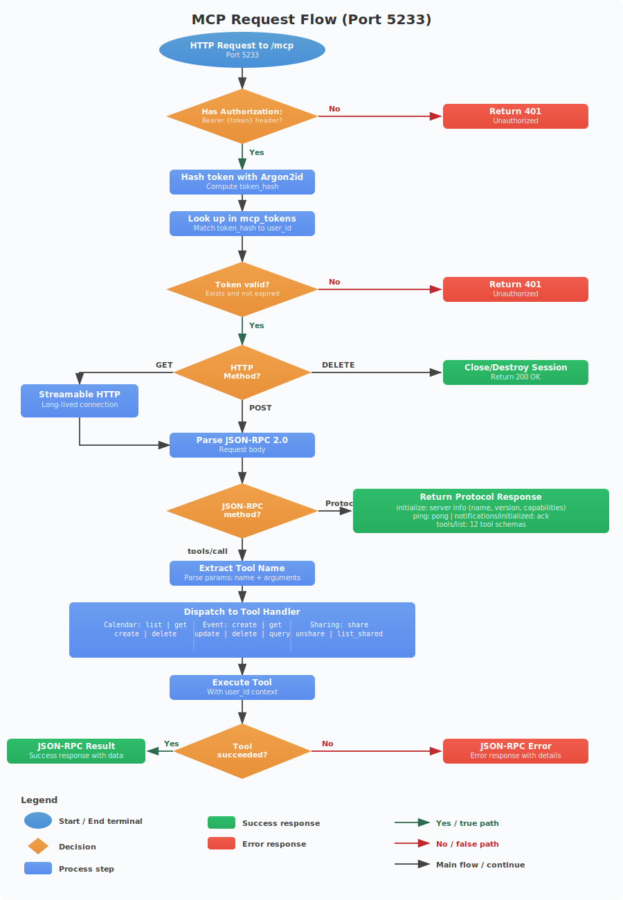

# MCP API Reference

The MCP (Model Context Protocol) server runs on port 5233 (configurable via `MCP_PORT`) and implements the [MCP specification](https://modelcontextprotocol.io/) version 2025-03-26 using Streamable HTTP transport.



## Authentication

All MCP endpoints require Bearer token authentication:

```
Authorization: Bearer mcp_<base64-encoded-token>
```

Tokens are created via the CLI (`create-token` command) and hashed with Argon2id before storage. See [CLI Reference](cli.md) for token management.

## Transport

The MCP server uses JSON-RPC 2.0 over HTTP:

| Endpoint | Method | Purpose |
|----------|--------|---------|
| `/mcp` | POST | Send JSON-RPC requests |
| `/mcp` | GET | Establish Streamable HTTP connection (long-lived) |
| `/mcp` | DELETE | Close/destroy session |

## Protocol Flow

1. Client sends `initialize` request
2. Server responds with capabilities
3. Client sends `notifications/initialized`
4. Client can now call `tools/list` and `tools/call`

### Initialize

**Request:**
```json
{
  "jsonrpc": "2.0",
  "id": 1,
  "method": "initialize",
  "params": {
    "protocolVersion": "2025-03-26",
    "capabilities": {},
    "clientInfo": {
      "name": "my-client",
      "version": "1.0"
    }
  }
}
```

**Response:**
```json
{
  "jsonrpc": "2.0",
  "id": 1,
  "result": {
    "protocolVersion": "2025-03-26",
    "capabilities": {
      "tools": {
        "listChanged": false
      }
    },
    "serverInfo": {
      "name": "caldav-mcp-server",
      "version": "0.1.0"
    }
  }
}
```

### List Tools

**Request:**
```json
{
  "jsonrpc": "2.0",
  "id": 2,
  "method": "tools/list"
}
```

Returns all 12 tools with their input schemas.

### Call Tool

**Request:**
```json
{
  "jsonrpc": "2.0",
  "id": 3,
  "method": "tools/call",
  "params": {
    "name": "tool_name",
    "arguments": { ... }
  }
}
```

### Ping

**Request:**
```json
{
  "jsonrpc": "2.0",
  "id": 4,
  "method": "ping"
}
```

**Response:**
```json
{
  "jsonrpc": "2.0",
  "id": 4,
  "result": {}
}
```

---

## Calendar Tools

### list_calendars

Lists all calendars owned by or shared with the authenticated user.

**Parameters:** None

**Example:**
```json
{
  "jsonrpc": "2.0",
  "id": 1,
  "method": "tools/call",
  "params": {
    "name": "list_calendars",
    "arguments": {}
  }
}
```

**Response:**
```json
{
  "jsonrpc": "2.0",
  "id": 1,
  "result": {
    "content": [
      {
        "type": "text",
        "text": "[{\"id\":\"cal-uuid\",\"name\":\"Work\",\"description\":null,\"color\":\"#0E61B9\",\"timezone\":\"UTC\",\"owner_id\":\"user-uuid\"}]"
      }
    ]
  }
}
```

### get_calendar

Gets detailed information about a specific calendar.

**Parameters:**

| Name | Type | Required | Description |
|------|------|----------|-------------|
| `calendar_id` | string | Yes | Calendar UUID |

**Response fields:** id, name, description, color, timezone, owner_id, ctag

### create_calendar

Creates a new calendar.

**Parameters:**

| Name | Type | Required | Default | Description |
|------|------|----------|---------|-------------|
| `name` | string | Yes | - | Display name |
| `description` | string | No | null | Calendar description |
| `color` | string | No | `#0E61B9` | Hex color |
| `timezone` | string | No | `UTC` | IANA timezone |

**Example:**
```json
{
  "jsonrpc": "2.0",
  "id": 1,
  "method": "tools/call",
  "params": {
    "name": "create_calendar",
    "arguments": {
      "name": "Personal",
      "color": "#FF5733",
      "timezone": "America/New_York"
    }
  }
}
```

**Response:** New calendar object with generated id.

### delete_calendar

Deletes a calendar and all its events.

**Parameters:**

| Name | Type | Required | Description |
|------|------|----------|-------------|
| `calendar_id` | string | Yes | Calendar UUID |

**Response:**
```json
{"deleted": true, "calendar_id": "cal-uuid"}
```

---

## Event Tools

### create_event

Creates a new calendar event.

**Parameters:**

| Name | Type | Required | Description |
|------|------|----------|-------------|
| `calendar_id` | string | Yes | Calendar UUID |
| `title` | string | Yes | Event title/summary |
| `start` | string | Yes | Start time (iCal format or ISO 8601) |
| `end` | string | Yes | End time (iCal format or ISO 8601) |
| `description` | string | No | Event description |
| `location` | string | No | Event location |

**Time formats accepted:**
- iCal: `20260301T090000Z`
- ISO 8601: `2026-03-01T09:00:00Z`

**Example:**
```json
{
  "jsonrpc": "2.0",
  "id": 1,
  "method": "tools/call",
  "params": {
    "name": "create_event",
    "arguments": {
      "calendar_id": "cal-uuid",
      "title": "Team Standup",
      "start": "20260301T090000Z",
      "end": "20260301T093000Z",
      "description": "Daily team sync",
      "location": "Conference Room A"
    }
  }
}
```

**Response:**
```json
{"uid": "generated-uuid@caldav-server", "calendar_id": "cal-uuid", "title": "Team Standup", "start": "20260301T090000Z", "end": "20260301T093000Z", "etag": "\"etag-value\""}
```

**Side effects:**
- Generates UID as `{UUID-v4}@caldav-server`
- Builds full iCalendar VCALENDAR/VEVENT
- Bumps calendar ctag and sync_token
- Logs sync_change as "created"

### get_event

Retrieves a specific event.

**Parameters:**

| Name | Type | Required | Description |
|------|------|----------|-------------|
| `calendar_id` | string | Yes | Calendar UUID |
| `event_uid` | string | Yes | Event UID |

**Response fields:** uid, calendar_id, summary, dtstart, dtend, etag, ical_data (full raw .ics)

### update_event

Updates an existing event (full replacement).

**Parameters:**

| Name | Type | Required | Description |
|------|------|----------|-------------|
| `calendar_id` | string | Yes | Calendar UUID |
| `event_uid` | string | Yes | Event UID |
| `title` | string | Yes | Updated title |
| `start` | string | Yes | Updated start time |
| `end` | string | Yes | Updated end time |
| `description` | string | No | Updated description |
| `location` | string | No | Updated location |

**Response:** Same format as create_event with new etag.

**Side effects:**
- Rebuilds entire iCalendar data
- Generates new ETag
- Bumps calendar ctag and sync_token
- Logs sync_change as "modified"

### delete_event

Deletes a specific event.

**Parameters:**

| Name | Type | Required | Description |
|------|------|----------|-------------|
| `calendar_id` | string | Yes | Calendar UUID |
| `event_uid` | string | Yes | Event UID |

**Response:**
```json
{"deleted": true}
```

**Error:** Returns JSON-RPC error if event not found.

### query_events

Queries events in a calendar with optional time-range filter.

**Parameters:**

| Name | Type | Required | Default | Description |
|------|------|----------|---------|-------------|
| `calendar_id` | string | Yes | - | Calendar UUID |
| `start` | string | No | - | Range start (iCal/ISO 8601 format) |
| `end` | string | No | - | Range end (iCal/ISO 8601 format) |
| `limit` | integer | No | 50 | Max results (max 500) |

**Time range logic:** `dtstart < end AND dtend > start` (overlap query).

**Example (all events in March 2026):**
```json
{
  "jsonrpc": "2.0",
  "id": 1,
  "method": "tools/call",
  "params": {
    "name": "query_events",
    "arguments": {
      "calendar_id": "cal-uuid",
      "start": "20260301T000000Z",
      "end": "20260401T000000Z",
      "limit": 100
    }
  }
}
```

**Response:** Array of event objects (uid, summary, dtstart, dtend, etag).

---

## Sharing Tools

### share_calendar

Shares a calendar with another user.

**Parameters:**

| Name | Type | Required | Description |
|------|------|----------|-------------|
| `calendar_id` | string | Yes | Calendar UUID (must be owned by caller) |
| `username` | string | Yes | Username to share with |
| `permission` | string | Yes | `"read"` or `"read-write"` |

**Example:**
```json
{
  "jsonrpc": "2.0",
  "id": 1,
  "method": "tools/call",
  "params": {
    "name": "share_calendar",
    "arguments": {
      "calendar_id": "cal-uuid",
      "username": "bob",
      "permission": "read-write"
    }
  }
}
```

**Response:**
```json
{"calendar_id": "cal-uuid", "shared_with": "bob", "permission": "read-write"}
```

**Behavior:**
- Validates target user exists
- Upserts share (INSERT OR UPDATE) - updates permission if share already exists

### unshare_calendar

Removes a calendar share.

**Parameters:**

| Name | Type | Required | Description |
|------|------|----------|-------------|
| `calendar_id` | string | Yes | Calendar UUID |
| `username` | string | Yes | Username to unshare from |

**Response:**
```json
{"unshared": true, "calendar_id": "cal-uuid", "username": "bob"}
```

**Error:** Returns JSON-RPC error if share doesn't exist.

### list_shared_calendars

Lists calendars that have been shared WITH the authenticated user (not calendars the user owns).

**Parameters:** None

**Response:**
```json
[{"id": "cal-uuid", "name": "Alice's Work", "owner_id": "alice-uuid", "permission": "read", "color": "#0E61B9"}]
```

---

## Error Handling

MCP tool errors are returned as JSON-RPC error responses:

```json
{
  "jsonrpc": "2.0",
  "id": 1,
  "error": {
    "code": -32000,
    "message": "Calendar not found"
  }
}
```

| Error Code | Meaning |
|-----------|---------|
| -32700 | Parse error (invalid JSON) |
| -32600 | Invalid request |
| -32601 | Method not found |
| -32602 | Invalid params |
| -32000 | Application error (tool-specific) |

**Authentication errors** return HTTP 401 before reaching the JSON-RPC layer:
```http
HTTP/1.1 401 Unauthorized
Content-Type: application/json

{"error": "unauthorized"}
```
